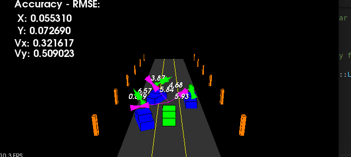

# SFND_Unscented_Kalman_Filter - CLoned From Udacity's Server
## The programs that are written to accomplish the project are src/ukf.cpp, and src/ukf.h

In this project I have implement an Unscented Kalman Filter to estimate the state of multiple cars on a highway using noisy lidar and radar measurements with RMSE values that are lower that the tolerance outlined in the project rubric. 

The main program can be built and ran by doing the following from the project top directory.

1. mkdir build
2. cd build
3. cmake ..
4. make
5. ./ukf_highway

`main.cpp` is using `highway.h` to create a straight 3 lane highway environment with 3 traffic cars and the main ego car at the center. 
The viewer scene is centered around the ego car and the coordinate system is relative to the ego car as well. The ego car is green while the 
other traffic cars are blue. The traffic cars will be accelerating and altering their steering to change lanes. Each of the traffic car's has
it's own UKF object generated for it, and will update each indidual one during every time step. 

The red spheres above cars represent the (x,y) lidar detection and the purple lines show the radar measurements with the velocity magnitude along the detected angle. The Z axis is not taken into account for tracking, so you are only tracking along the X/Y axis.

---

## Other Important Dependencies
* cmake 
* PCL 1.2

## UKF Algorithm

At every iteration,
1. Run the lidar and radar sense functions to get an simulated measurement input
2. Initialize the position of obstacles if not been initialized.
3. Later exectute the motion predict step
4. After that execute the measurement update step and return the filtered mean and covariance of the obstacle's position.
5. Run the above 4 steps till the simulation ends.
For more details, look at the assignments folder.
